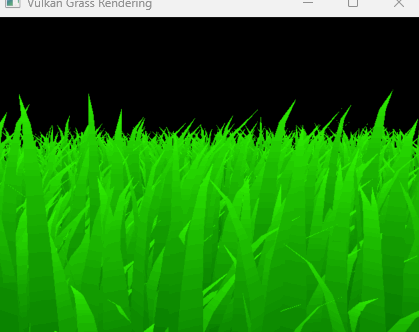
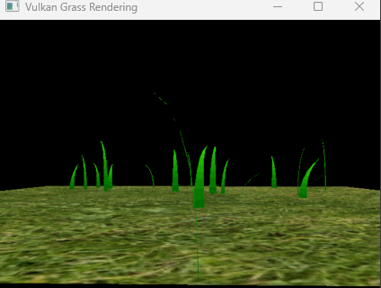
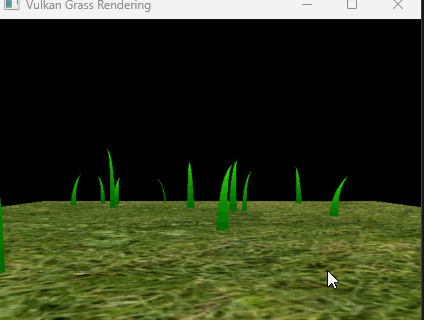
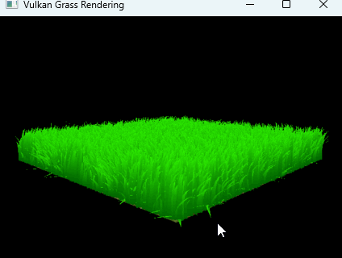
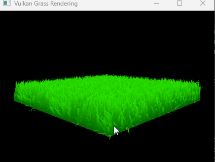
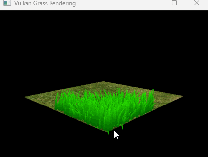
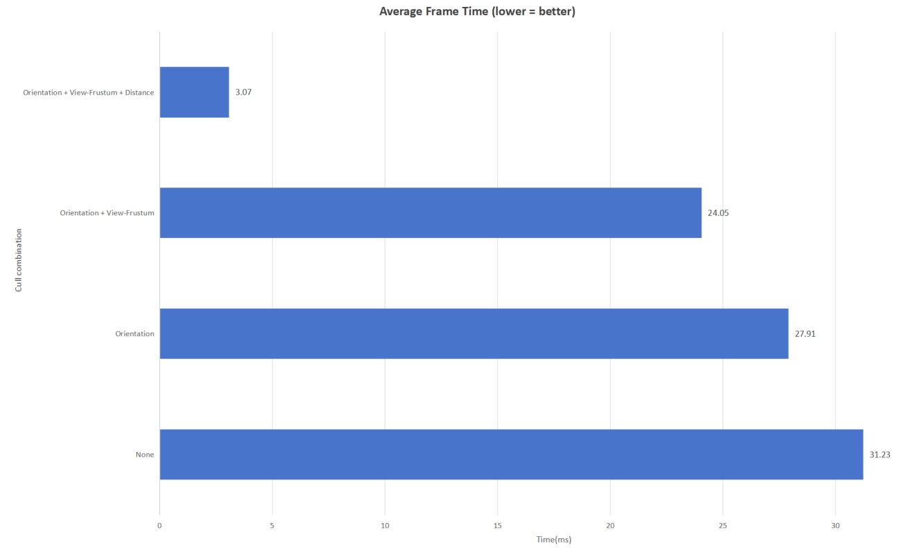

Vulkan Grass Rendering
==================================

**University of Pennsylvania, CIS 565: GPU Programming and Architecture, Project 5**

* Akiko Zhu
  * [LinkedIn](https://www.linkedin.com/in/geming-akiko-zhu-b6705a255/)
* Tested on: Windows 11, i9-12900H @ 2.50GHz 16GB, RTX 3070Ti 8GB (Personal)

## Overview

This is a Vulkan-based grass simulation project. The algorithm and detailed implementation are referenced to this paper:
- [Responsive Real-Time Grass Rendering for General 3D Scenes](https://www.cg.tuwien.ac.at/research/publications/2017/JAHRMANN-2017-RRTG/JAHRMANN-2017-RRTG-draft.pdf).

## Implementation
### Grass Blade Representation

- The grass blades are represented as Bezier curves, each Bezier curve has three control points v0, v1, and v2.
- Besides, we stored per-blade characteristics such as normal, orientation, height, width, and stiffness in the blade structure so that we can efficiently simulate and tessellate the grass blades.

### Force
- Gravity
  - We assume the gravity value is 9.8 and the direction of the gravity is the negative direction of the Y-axis.

- Recovery
  - This is a counter-force that brings the grass blade back into equilibrium.

- Wind
  - We use cosine and sine functions, to simulate the strength of the natural wind, making each cluster of grass blades swing like being blown by the wind

  

### Culling
- Orientation Culling
  - Because the grass blade doesn't have thickness in this simulation, we don't want the side of the grass blade to cause any artifacts. Therefore, we cull the rendering if the grass pixel is less than 0.1.
    
    | Without O.C. | With O.C. |
    |-|-|
    |||
    
- View-frustum Culling
  - In order to improve the render performance, we can cull the grass blades that is not in the camera view
    | Without V.F.C. | With V.F.C. |
    |-|-|
    |||
- Distance Culling
  - In addition, we can cull the grass blades that are too far from the camera.
    | Without D.C. | With D.C. |
    |-|-|
    |||

## Performance Analysis
- 2^17 grass blades in the test scene
  
  As shown in the diagram, the combination of "Orientation, View-Frustum, and Distance" culling leads to an efficient performance improvement when rendering the grass simulation.
